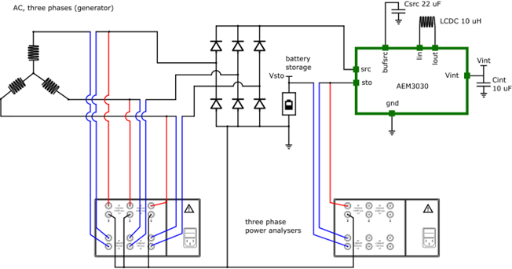

# H-Hope energy harvester electronic design

The electronic design of the DIY H-HOPE energy harvester is intended to enable the practical use of the voltage and current generated by the induction generator. As the H-Hope energy harvester is a small-scale device, it is expected to produce only a limited amount of electrical energy. In many cases, the raw voltage levels generated will be insufficient to directly power electronic circuits, charge batteries, or supply sensing equipment without additional conditioning.

Furthermore, the three phase induction generator operation produces a three-phase alternating voltage with significant fluctuations before rectification. Unlike the three-phase synchronous generators used in large power plants, the rectified output voltage from the DIY H-Hope generator may continue to exhibit noticeable temporal variations. This deviation from ideal behavior is primarily due to several factors inherent in the DIY fabrication approach and the nature of the energy harvesting method itself:
 -	The fluctuating mechanical input caused by the cylinder oscillatory movements around its equilibrium position, driven by vortex shedding,
 -	The variations in the magnetic field strength B of the permanent magnets used among individual magnets,
 -	The non-ideal positioning and orientation of the permanent magnets within the rotor wheel,
 -	The manufacturing inconsistencies in the stator coils, including variability in winding quality and material properties,
 -	The imperfections in the placement and adhesion of the coils in the stator structure,
 -	The geometrical tolerances and material variability introduced by additive manufacturing (3D printing) methods,
 -	The flow-induced vibrations during operation, caused by environmental factors such as turbulence, changes in submergence depth, and stream flow properties,
 -	The mechanical vibrations and imbalances of rotating parts due to limitations in DIY assembly precision.

These factors, individually and collectively, contribute to fluctuations in the generated voltage and current that are difficult to fully eliminate using DIY techniques. Therefore, any electronic system designed for the H-HOPE harvester must take these variations into account to ensure stable and reliable operation.
This section focuses on addressing **two critical tasks necessary for managing the electrical output of the H-HOPE DIY generator**:

 -	**Rectification** of the three-phase voltage produced by the generator into a usable direct current (DC) form;
 -	**Voltage boosting** and **energy storage**, to raise the DC voltage to a level suitable for practical use and to provide a buffer for periods of low energy generation.

It is important to note that the electronics presented here represent preliminary concepts intended for educational and prototyping purposes.

## **H-Hope DIY rectification circuit**
Once obtained the alternating current (AC) from the induction generator, the first step is its rectification, obtained according to the scheme reported in Figure 1. 
  

Figure 1. The schematics of efficiency measurement of the three-phase diode bridge rectifier circuit operation for the case of three-phase AC input voltage. AEM30330 was used as an example for the voltage boost circuit. The rectification circuit is located in the mddle on the top, composed of six diodes.

For our rectification process, a Schottky diode was adopted. This diode is a semiconductor device characterized by a metal-semiconductor junction, enabling current to flow in only one direction with a notably low forward voltage drop and rapid switching capabilities. Unlike conventional PN junction diodes (such as silicon diodes), Schottky diodes do not have a pronounced depletion layer, which allows for faster response times and reduced power losses. With a typical forward voltage drop ranging from 0.15V to 0.45V, Schottky diodes are particularly well-suited for rectification applications where minimizing power loss is critical, as is the case in energy harvesting systems.

Regarding the type of rectifiers, we employed multiple full-wave rectifiers. Indeed, in the case of a half-wave rectifier, a single Schottky diode only allows the positive half-cycle of the input AC voltage to pass through, blocking the negative half-cycle. This results in a pulsating direct current (DC) waveform with gaps corresponding to the missing negative half-cycle. In contrast, a full-wave single-phase rectifier utilizes a bridge configuration of four Schottky diodes to rectify both the positive and negative half-cycles of the input AC voltage, producing a continuous DC output. This method offers a smoother DC waveform, making it more suitable for stable power supply applications. 

Each full-wave rectifier in our system uses four ultralow forward voltage drop Schottky diodes arranged in a bridge configuration, as shown in Figure 13. The diodes operate in pairs, and the output voltage is reduced by approximately twice the forward voltage drop of the diodes—approximately 0.3V at a 0.01A load. During each AC cycle, only two diodes conduct current at a time. In the positive half-cycle of the AC input, diodes D1 and D2 are forward-biased and conduct current, while diodes D3 and D4 remain reverse-biased and do not conduct. Conversely, in the negative half-cycle of the AC input, diodes D3 and D4 are forward-biased and conduct current, while diodes D1 and D2 are reverse-biased and do not conduct. In both cycles, the direction of the current remains unchanged, resulting in a unidirectional current flow and a steady DC output.

In addition to the rectification circuit, Figure 1 also illustrates the energy management modules used for energy harvesting post-rectification. Specifically, we have incorporated the AEM 30330 energy management module as an example.

##	**Using energy management modules for energy harvesting after rectification**
In small-scale energy harvesting systems, such as the H-HOPE DIY harvester, the output of the generator after rectification typically presents a low and fluctuating direct current (DC) voltage. These fluctuations, as discussed above, arise from the dynamic nature of the mechanical input, the variations in flow conditions, and inherent imperfections in DIY fabrication processes. To reliably power electronics or to store harvested energy, additional power management is necessary. This is where specialized energy management modules become essential.

After the initial rectification of the three-phase alternating voltage generated by the harvester, the resulting DC voltage is often unstable and insufficient to directly power loads such as microcontrollers, wireless sensors, or battery charging circuits. Energy management modules are designed to bridge this gap by performing three critical tasks: stabilizing the input voltage, boosting it to usable levels, and managing the storage and regulated supply of energy.

These modules typically incorporate a highly efficient DC/DC converter with an ultra-low input voltage threshold, enabling them to start operating with harvested voltages as low as a few hundred millivolts. Once operational, they boost the voltage to standard regulated outputs (such as 1.8V, 2.5V, or 3.3V), suitable for powering electronic circuits. Moreover, they often include power path management, meaning they can simultaneously charge an energy storage element (such as a supercapacitor or rechargeable battery) while powering an active load.

An example of such a device is the AEM30330 by E-Peas, which is designed for low-power energy harvesting applications. It accepts a wide range of input voltages after rectification and offers configurable regulated outputs, internal maximum power point tracking (MPPT) algorithms, and efficient storage management. Modules like the AEM30330 allow systems to harvest intermittent or low-intensity energy and convert it into a stable and reliable energy source.

In practical terms, integrating an energy management module after rectification ensures that even when the harvester output is irregular or temporarily insufficient, critical loads can continue operating from stored energy. It also protects sensitive electronics from voltage drops and surges, extending the operational lifetime and reliability of the system.
In conclusion, adding an energy management module after rectification is a necessary and highly effective step in DIY energy harvesting applications. It enables the full utilization of the energy generated under real-world fluctuating conditions, providing stable operation for sensing, communication, and energy storage tasks crucial for decentralized and resilient renewable energy systems.

